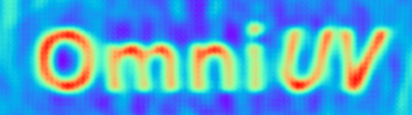
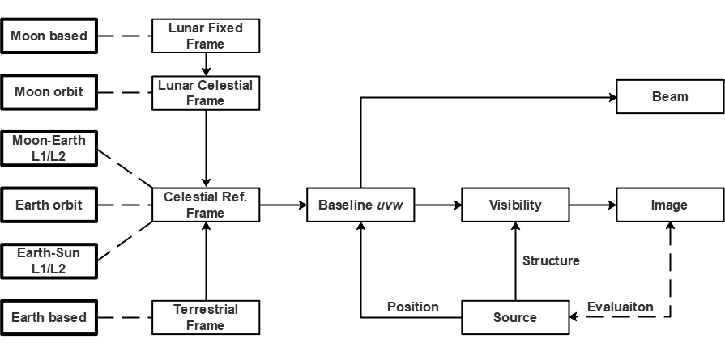

# Omni*UV*: An Omnipotent VLBI Simulation Toolkit

#
## Introduction

We develop Omni*UV*, so as to fulfill the requirement of simulation for both ground and space VLBI observations. 

Omni*UV* supports the following types of ground and space stations:

- Earth fixed (ground);
- Earth orbit;
- Moon fixed;
- Moon orbit;
- Earth-Sun Lagrange 1/2 points; 
- Earth-Moon lagrange 1/2 points.

The main functionalities of the toolkit are:

- Trajectory calculation;
- Baseline *uv* calculation, by taking the availability of each station into account; 
- Visibility simulation for the given *uv* distribution, source structure and system noise;
- Beam and image reconstruction.

Omni*UV* supports two types of calculation methods for visibility simulation and imaging (taking img -> vis for example):

- FFT: point sources are first assigned to the nearby grids in the image plane via certain kind of assignment function, then FFTed to the *uv* plane. Visibilities are reconstructed at given *uv* position via interpolation (assignment) function. 
    - Fast, therefore popular;
    - Suitable for small field;
    - *w* term cannot be taken into account;
    - Artifacts are introduced during gridding.
##
- Direct summation: direct calculation via Eq. 3 and 6 in the paper.
    - Slow, therefore requiring GPU speedup;
    - Suitable for wide field;
    - w* term is naturally supported;
    - No gridding artifact.

