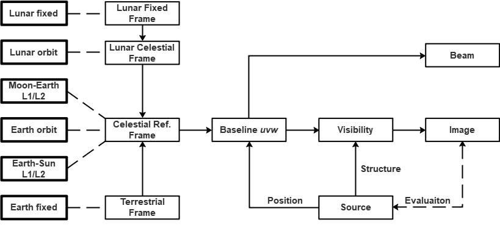

# Omni*UV*: An Omnipotent VLBI Simulation Toolkit

---

## **Introduction**

We develop Omni*UV*, so as to fulfill the requirement of simulation for both ground and space VLBI observations. 

---

### **Functionality**
The main functionalities of the toolkit are:

- Trajectory calculation;
- Baseline *uv* calculation, by taking the availability of each station into account; 
- Visibility simulation for the given *uv* distribution, source structure and system noise;
- Image and beam reconstruction.

Omni*UV* supports two types of methods for visibility and imaging calculation (taking img -> vis for example):

- **FFT**: point sources are first assigned to the nearby grids in the image plane via certain kind of assignment function, then FFTed to the *uv* plane. Visibilities are reconstructed at given *uv* position via interpolation (assignment) function. 
    - Fast, therefore popular;
    - Suitable for small field;
    - *w* term cannot be taken into account;
    - Artifacts are introduced during gridding.
- **Direct summation**: direct calculation via Eq. 3 and 6 in the paper.
    - Slow, therefore requiring GPU speedup;
    - Suitable for wide field;
    - *w* term is naturally supported;
    - No gridding artifact.

---

### **Source**
A Source in Omni*UV* actually refers to a **phase center**.

Omni*UV* supports _uvw_ calculations for multiple sources (phase centers). For each source, the input _ra_ and _dec_ are first converted to a unit vector in CRS: 

__s0__ = (_x_, _y_, _z_)

with:

_x_ = cos(_dec_) * cos(_ra_)

_y_ = cos(_dec_) * cos(_ra_)

_z_ = sin(_dec_)

The defination of the _uvw_ system follows that in the standard textbook (Thompson et al. 2001):

Given North Pole direction __n__ = (0, 0, 1) and source direction __s0__, __w__ is in the same direction as __s0__:

__w__ = __s0__,

 __u__ is the direction perpendicularto the plane defined by __n__ and __w__:

__u__ = __n__ x __w__,

__v__ is defined accordingly:

__v__ = __w__ x __u__.

---

### **Station**
Omni*UV* supports the following types of ground and space stations:

- Earth fixed (ground);
- Earth orbit;
- Moon fixed;
- Moon orbit;
- Earth-Sun Lagrange 1/2 points; 
- Earth-Moon Lagrange 1/2 points.

The trajectories of stations are first calculated in ther own coordinate system, and then tranformed to the **Celestial Reference System (CRS)**. 

The station _uvw_ is the projection of CRS position __p__ in the _uvw_ system defined above: 

(_u_, _v_, _w_) = (__u__, __v__, __w__) __·__ __p__.

The baseline _uvw_ is formed accordingly, by taking the station availability in each moment into account.

---

### **Image**
Visibility simulation requires an image as input. An image is binded to a source, and is described as a list of pixels (point sources). For each pixel, one has to provide the corresponding coordinate and flux. See `run_example.py` for a detailed example.

The _lmn_ of each pixel is the projection of the pixel position __s__ in the _uvw_ system defined above:

(_l_, _m_, _n_) = (__u__, __v__, __w__) __·__ __s__.

---

## **Prerequisites**

- Linux system
- Any version of Python 3.6, 3.7, 3.8, 3.9.

---

## **Installation**
 
- The toolkit is provided as precompiled package (`pyc` files). Please select the appropriate Python version and unpack. If you are not sure your Python version, please run the following command:

    `python --version`

- If you are in mainland China, please first run

    `sh pip_mirror.sh` 
  
    to select the pip host provided by aliyun.

- Install dependences:

    `pip install -r requirements.txt`

    Then the toolkit is ready.
